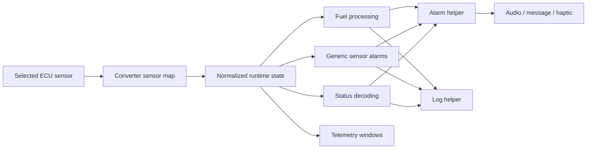
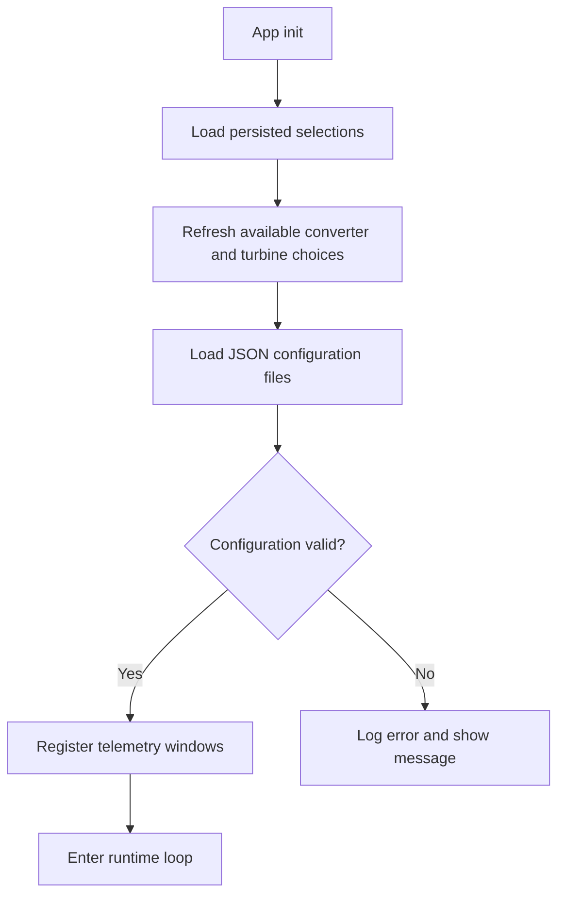

# Jeti ECU Turbine Telemetry

Jeti Lua application for turbine ECU monitoring, alarm handling, and telemetry presentation on Jeti transmitters.

The project provides a configurable dashboard for turbine status, RPM, EGT, ECU voltage, pump voltage, and fuel, with support for voice alerts, message popups, haptic feedback where available, and centralized debug logging.

## Quick start

If you want the shortest path to a working setup:

1. copy `ecu.lc` or `ecu_16.lc` to the transmitter
2. copy the full `ecu/` directory to the transmitter
3. add the ECU app from the transmitter Applications menu
4. choose converter family, turbine family, turbine config, battery config, and ECU sensor
5. verify the app starts without `Err`
6. if it shows `Err`, open the debug console and use the log output to find the failing config or sensor mapping

## Features

- reads telemetry from a selected ECU sensor source
- maps converter-specific parameters into a common runtime format
- applies turbine-specific alarm and status rules from JSON configuration files
- renders dedicated telemetry windows for live turbine monitoring
- delays alarm activation during startup stabilization
- supports status-driven voice, message, and haptic alerts where available
- suppresses repeated alarms with timed cooldown behavior
- handles fuel threshold warnings and critical alerts
- detects ECU offline conditions after signal loss
- reports important faults through a shared logger to make debugging easier

## Feature sets

| Feature set | Target | Notes |
| --- | --- | --- |
| `ecu.lua` | Jeti transmitters with more memory | Main full-featured entrypoint |
| `ecu_16.lua` | Older/lower-memory Jeti transmitters | Leaner runtime with reduced feature footprint |
| `ecu.lc` | Compiled install for newer transmitters | Compiled artifact of `ecu.lua` |
| `ecu_16.lc` | Compiled install for older transmitters | Compiled artifact of `ecu_16.lua` |

The root entrypoints above are the active scripts.

## Telemetry windows and visualization

The active telemetry presentation is intentionally simple and fast to render on the transmitter.

### Full app: `ecu.lua`

The full app registers **two telemetry windows**.

#### Window 1

Shows the most important in-flight status information:

- **fuel level** on the left
- **turbine status text** at the upper right
- **pump voltage** and **ECU voltage** at the lower right

Visualization:

- fuel is shown as a **vertical segmented gauge** with `F` and `E` markers
- when fuel is critically low, the normal gauge is replaced by a **blinking warning triangle** with the remaining percentage
- turbine status is shown as large text such as normal status, `UNKNOWN`, `UNCONFIG`, `NO CONFIG`, or `OFFLINE`
- pump and ECU voltages are shown as direct numeric voltage readouts

#### Window 2

Shows live engine values and peak values:

- **ECU battery/voltage level** as a gauge on the left
- **RPM** current and maximum values
- **RPM2** current and maximum values
- **EGT** current and maximum values

Visualization:

- ECU voltage is shown as a **vertical segmented battery-style gauge**
- RPM, RPM2, and EGT are shown in a compact **table layout** with `SENS`, `NOW`, and `MAX` columns
- RPM is abbreviated in **thousands** using `K`
- EGT is shown in **degrees C**

### Low-memory app: `ecu_16.lua`

The `-16` version registers **one telemetry window**, roughly equivalent to Window 1 in the full app:

- fuel gauge on the left
- turbine status text on the upper right
- pump and ECU voltage readouts on the lower right

This keeps the low-memory transmitter version focused on the most important operational data.

### Experimental windows

There are additional experimental/legacy window modules in the repository, but they are **not registered by default** in the active runtime.

## Supported configuration families

The repository currently contains configuration folders for these converter families:

- `vspeak`
- `digitech`
- `jetcat`
- `kingtech`
- `xicoy`
- `cbelectroniks`
- `ecusimulator`

The turbine profile folders currently include families such as:

- `amt`
- `behotec`
- `colibri`
- `evojet`
- `graupner`
- `hammer`
- `hornet`
- `jakadofsky`
- `jetcat`
- `kingtech*`
- `lambert`
- `orbit`
- `pbs`
- `xicoy*`

## Supported combinations grid

This grid reflects the current converter-to-turbine combinations present in the repository configuration folders.

| Converter \ Turbine | `amt` | `evojet` | `graupner` | `hammer` | `hornet` | `jakadofsky` | `jetcat` | `kingtech` | `kingtechg1` | `kingtechg2` | `lambert` | `pbs` | `xicoyv6` | `xicoyv10` | `xicoyvx` |
| --- | --- | --- | --- | --- | --- | --- | --- | --- | --- | --- | --- | --- | --- | --- | --- |
| `cbelectroniks` | — | — | — | — | — | — | ✅ | — | — | — | — | — | ✅ | ✅ | — |
| `digitech` | — | ✅ | ✅ | ✅ | ✅ | — | ✅ | — | ✅ | ✅ | ✅ | — | ✅ | ✅ | — |
| `ecusimulator` | ✅ | ✅ | — | — | ✅ | ✅ | ✅ | — | — | — | — | ✅ | — | — | — |
| `jetcat` | — | — | — | — | — | — | ✅ | — | — | — | — | — | — | — | — |
| `kingtech` | — | — | — | — | — | — | — | — | ✅ | ✅ | — | — | — | — | — |
| `vspeak` | ✅ | ✅ | — | — | ✅ | ✅ | ✅ | ✅ | — | — | — | ✅ | — | — | — |
| `xicoy` | — | — | — | — | — | — | — | — | — | — | — | — | ✅ | ✅ | ✅ |

Notes:

- `✅` means a matching converter/turbine folder combination exists in the repo
- `—` means there is no matching converter mapping folder currently in the repo
- turbine profile folders such as `behotec`, `colibri`, `orbit`, `kingtechg3`, `kingtechg4`, and `kingtechg5` exist, but they do not currently appear in converter-family mapping folders
- some names intentionally differ between converter and turbine families, for example `vspeak -> kingtech` and `kingtech -> kingtechg1` / `kingtechg2`
- this grid describes configuration presence in the repo, not a guarantee that every combination has been equally flight-tested

## Installation on a transmitter

### Option 1: Install with Jeti Studio

1. Install Jeti Studio.
2. Connect the transmitter to your computer.
3. Open the Lua App Manager in Jeti Studio.
4. Install the ECU app.
5. Copy the matching compiled file to the transmitter:
   - use `ecu.lc` for newer transmitters with more memory
   - use `ecu_16.lc` for older lower-memory transmitters
6. Ensure the `ecu/` asset folder is also present on the transmitter.

### Option 2: Manual file copy

Copy these items to the transmitter application storage:

- `ecu.lc` or `ecu_16.lc`
- the full `ecu/` directory

After that:

1. start the transmitter normally
2. open the Applications menu
3. add the ECU app
4. select converter type, turbine type, turbine config, battery config, and ECU sensor

## First-time setup on the transmitter

Typical setup steps:

1. choose the converter family
2. choose turbine family
3. choose turbine config preset
4. choose battery config
5. choose the ECU telemetry sensor
6. set tank size if required by the selected configuration
7. assign alarm-off / message-off / audio-off / haptic-off switches where supported

Most combinations are designed so you do not need to edit JSON manually.

## Logging and debugging

The codebase now includes centralized logging through `ecu/lib/loghelper.lua`.

That means important faults such as these are logged consistently:

- missing config files
- invalid JSON
- missing audio files
- missing sensor mappings
- unknown status codes
- missing status configuration
- offline transition issues

If the app reports `Err` on the transmitter:

1. open the app entry
2. press the transmitter command/debug button
3. capture the debug console output
4. include that output when reporting issues

## Errors, crashes, and troubleshooting on the transmitter

### Common error situations

The app now logs important failure paths such as:

- missing config files
- invalid JSON config content
- missing audio files
- missing sensor mappings
- unknown turbine status codes
- missing status configuration
- ECU/sensor offline conditions
- incomplete or invalid runtime configuration

### Where the logs are

Runtime logs are written with `print(...)` through the shared logger and appear in the transmitter's **application debug / command console**.

They are also available through Jeti logging, so the log messages can be reviewed later when you analyze recorded telemetry data.

If the app shows `Err` or appears to fail during startup:

1. open the transmitter **Applications** menu
2. highlight the ECU app
3. press the **CMD / command** button
4. read or photograph the displayed debug log

Typical log lines look like this:

- `[ECU][ERROR][validateConfig] Missing converter sensor map`
- `[ECU][ERROR][loadhelper.fileJson] File not found: ...`
- `[ECU-16][WARN][processStatus] Unknown status code: ...`

### How to solve transmitter startup failures or crashes

Use this checklist in order:

1. **Confirm the correct compiled file is installed**
   - newer transmitters: `ecu.lc`
   - older/lower-memory transmitters: `ecu_16.lc`

2. **Confirm the full `ecu/` asset folder was copied**
   - missing JSON, locale, or audio files can break startup or leave the app unusable

3. **Open the debug console log**
   - the first `ERROR` line usually points to the failing file, sensor map, or status config

4. **Re-copy the app files if the update may have been partial**
   - replace both the compiled file and the `ecu/` directory together

5. **Check the selected configuration on the transmitter**
   - verify converter family, turbine family, turbine config, battery config, and ECU sensor were selected correctly

6. **If the app says `NO CONFIG` or `UNCONFIG`**
   - reopen setup and select the missing configuration items again
   - verify that the chosen converter/turbine combination actually exists in the repo-supported config set

7. **If the app says `OFFLINE`**
   - the app started, but the expected telemetry is not currently valid
   - verify the ECU is powered, the converter is connected, and the correct telemetry sensor was selected

8. **If the log mentions missing or invalid JSON**
   - re-copy the affected configuration files
   - if you customized JSON manually, validate the syntax and restore a known-good file if needed

9. **If the log mentions missing audio files**
   - re-copy the `ecu/audio/` content or the full `ecu/` folder

10. **If the app still crashes after a clean copy**
    - remove the app entry from the transmitter
    - copy the files again
    - add the app again
    - collect a fresh debug log before changing other settings

### Best way to report a crash

When reporting a transmitter crash or startup failure, include:

- transmitter model
- whether you used `ecu.lc` or `ecu_16.lc`
- selected converter family
- selected turbine family/config
- a photo or screenshot of the **CMD/debug console log**
- whether the app showed `Err`, `NO CONFIG`, `UNCONFIG`, or `OFFLINE`

## Legacy videos

- Installation and setup: https://youtu.be/tsEkAW4Y2tU
- Normal usage simulation: https://youtu.be/evyAzlbLs68
- Alarm-heavy flight simulation: https://youtu.be/_tN6GDu43rU
- ECU simulator test rig: https://youtu.be/EmGTHrpVQJE

## Screenshots

Representative screenshots from installation, alarms, and telemetry presentation:


## Technical reference

### Runtime architecture



### Startup flow



### Configuration model

The app is built around configuration files instead of per-user code edits.

At startup, the selected combination is assembled from:

- converter config in `ecu/converter/.../config.jsn`
- turbine config in `ecu/turbine/.../*.jsn` or `ecu/turbine_16/.../*.jsn`
- battery config in `ecu/batterypack/*.jsn` or `ecu/batterypack_16/*.jsn`
- fuel config in `ecu/fuel/config.jsn` or `ecu/fuel_16/config.jsn`
- status config in `ecu/status/*.jsn`
- locale config in `ecu/locale/*.jsn`

`ecu.lua` uses the full `turbine/`, `batterypack/`, and `fuel/` schemas. `ecu_16.lua` uses the reduced `turbine_16/`, `batterypack_16/`, and `fuel_16/` schemas to save memory.

The menus on the transmitter are filesystem-driven:

- converter menu = folders in `ecu/converter/`
- turbine menu = folders inside `ecu/converter/<converter>/`
- turbine config menu = `.jsn` files in `ecu/turbine/<turbine>/` or `ecu/turbine_16/<turbine>/`
- battery menu = `.jsn` files in `ecu/batterypack/` or `ecu/batterypack_16/`

This means a new turbine will not appear in setup unless the expected folders and files exist in the right places.

All `.jsn` files are parsed as strict JSON. Keep them strict:

- no trailing commas
- no comments inside JSON
- quoted keys and string values
- matching braces and brackets

One malformed `.jsn` file is enough to break startup or leave the app in an unusable configuration.

### Using `senslist.lua` to add support for a new turbine

`senslist.lua` is a discovery helper for learning how a converter/ECU exposes telemetry on Jeti. Use it when you need to build or verify a converter mapping for a new turbine or converter family.

What it does:

- reads `system.getSensors()`
- prints each top-level telemetry sensor label and each child telemetry label with its `param`
- writes a helper file named `Apps/<sensor-label>.jsn`

What it does **not** do:

- it does not generate a finished runtime config for `ecu/`
- it does not discover the meaning of each numeric ECU status code for you
- it does not replace testing on live telemetry or in the emulator

Important note: the generated `Apps/<sensor-label>.jsn` file is a scratch file only. It starts a JSON-like `statusmap` block, but it is not a finished valid config file and should not be copied directly into `ecu/`.

Recommended workflow:

1. copy `senslist.lua` to the transmitter or emulator as a temporary app
2. power the ECU/converter so live telemetry is available
3. run `senslist.lua`
4. note the top-level sensor label (`param == 0`)
5. note each child telemetry label and its `param`
6. translate those child labels into the ECU app runtime names:
   - `rpm` = turbine rpm
   - `rpm2` = shaft rpm or secondary rpm
   - `egt` = exhaust gas temperature
   - `pumpv` = pump voltage
   - `ecuv` = ECU voltage / ECU battery voltage
   - `fuel` = remaining fuel or consumed fuel
   - `status` = raw ECU status code
7. create or update `ecu/converter/<converter>/<turbine>/config.jsn`
8. observe the raw `status` sensor while the ECU changes state, then build `statusmap` from numeric code to status text
9. create or update the matching turbine, status, battery, and fuel JSON files
10. test in the emulator or on the transmitter and watch the debug log for missing keys, unknown statuses, or missing files

The ECU app itself stores the selected top-level sensor `id` when the user chooses the ECU sensor in setup, so configuration authors usually only need the discovered `param` numbers from `senslist.lua`.

In practice:

- if a turbine uses an existing converter layout and the same status naming, you may only need new presets under `ecu/turbine/` and `ecu/turbine_16/`
- if the telemetry layout or status codes differ, you also need a new `ecu/converter/<converter>/<turbine>/config.jsn`
- if the named statuses differ, you also need a matching `ecu/status/<turbine>.jsn`

### JSON file reference

#### `ecu/converter/<converter>/<turbine>/config.jsn`

Purpose:

- maps converter-specific telemetry params into the common runtime names
- tells the fuel helper whether the raw fuel value counts down or up
- translates raw numeric status codes into named statuses

Expected keys:

- `sensormap`
  - object keyed by runtime sensor name
  - values are Jeti `param` numbers, usually stored as strings
  - use `0` or omit a key if a sensor is not provided by the converter
- `fuel.countingdown`
  - `true` when the ECU reports remaining fuel directly
  - `false` when the ECU reports consumed fuel and the app must calculate fuel remaining
- `statusmap`
  - object keyed by raw numeric status codes as strings
  - values are human-readable status names

Common `sensormap` keys are:

- `rpm`
- `rpm2`
- `egt`
- `pumpv`
- `ecuv`
- `fuel`
- `status`

#### `ecu/turbine/<turbine>/*.jsn`

Purpose:

- defines full-version turbine sensor thresholds and alarm behavior for `ecu.lua`

Typical top-level keys are:

- `rpm`
- `rpm2`
- `egt`
- `pumpv`

Each sensor block uses this shape:

- `sensorname`
- `high`
- `low`

Each `high` and `low` block contains alarm metadata such as:

- `text` - human-readable alarm label used when the warning is presented, for example `EGT high` or `RPM low`
- `value` - numeric threshold that triggers the alarm
- `message.enable` - enables or disables the Jeti popup message for that threshold
- `message.seconds` - how long the popup message stays visible
- `audio.enable` - enables or disables playback of the configured warning sound
- `audio.file` - `.wav` file to play from `Apps/ecu/audio/`
- `haptic.enable` - enables or disables transmitter vibration for that threshold
- `haptic.stick` - which side should vibrate, typically `left` or `right`
- `haptic.vibrationProfile` - Jeti vibration pattern/profile number used for the haptic alert

The intended operating model is a **silent cockpit**: in normal operation the app should stay quiet from sound and vibration, and only produce audio/haptic alerts when a real warning, failure, or other meaningful abnormal condition occurs. Normal running states can still use text messages when useful, but audio and vibration should remain reserved for real issues.

These files normally cover turbine-specific limits only. Battery, fuel, and status behavior are merged in from separate JSON files.

#### `ecu/turbine_16/<turbine>/*.jsn`

Purpose:

- defines the reduced threshold schema used by `ecu_16.lua`

Schema difference from the full version:

- uses plain numeric `high` and `low` values instead of nested alarm objects
- typically includes `rpm`, `rpm2`, `egt`, `pumpv`, and `status`
- `status` usually only needs `sensorname`

#### `ecu/batterypack/*.jsn`

Purpose:

- defines ECU battery alarm thresholds and actions for the full app

Schema:

- same general alarm-block structure as the full turbine sensor files
- `sensorname` is normally `ecuv`
- includes metadata such as `type` and `cells`

#### `ecu/batterypack_16/*.jsn`

Purpose:

- defines simplified ECU battery thresholds for the low-memory app

Schema:

- `sensorname`
- `type`
- `cells`
- numeric `high`
- numeric `low`

#### `ecu/fuel/config.jsn`

Purpose:

- defines full-version fuel handling and fuel alarms

Keys:

- `sensorname`
- `tanksize`
- `unit`
- `sensorproblem`
- `alarms`

`alarms` is an array of alarm objects. Keep the array ordered from the lowest remaining-fuel threshold to the highest threshold, because the runtime uses the first threshold that matches.

`fuelhelper` combines this file with `converter.fuel.countingdown` to decide whether the raw fuel value represents remaining fuel or consumed fuel.

#### `ecu/fuel_16/config.jsn`

Purpose:

- defines the low-memory fuel display and warning thresholds

Keys:

- `sensorname`
- `tanksize`
- `decimals`
- `unit`
- `label`
- `warning`
- `critical`

#### `ecu/status/<turbine>.jsn`

Purpose:

- defines what the app should do when the ECU enters a named status

Schema:

- top-level `sensorname` is `status`
- every other top-level key is a named ECU status such as `Run`, `Off`, `Failure`, or `Accelerate`
- each status entry defines `text`, `message`, `audio`, and `haptic` behavior

The values in `converter/.../config.jsn -> statusmap` should match these status keys exactly. If they do not match, the app logs the status as unknown or missing configuration.

#### `ecu/locale/<language>.jsn`

Purpose:

- stores translated UI text

Used for:

- app name
- setup menu labels
- telemetry window titles
- switch labels

The app first tries `system.getLocale()` and then falls back to `ecu/locale/en.jsn`.

### Minimal file set when adding support

For a new full-version converter/turbine combination, the usual minimum is:

- `ecu/converter/<converter>/<turbine>/config.jsn`
- `ecu/turbine/<turbine>/<preset>.jsn`
- `ecu/status/<turbine>.jsn`

For the low-memory version, add:

- `ecu/turbine_16/<turbine>/<preset>.jsn`

Usually you can reuse the shared battery and fuel presets unless the converter requires a genuinely different battery or fuel interpretation.

If you want the same turbine family to be selectable in both active entrypoints, keep `ecu/turbine/<turbine>/` and `ecu/turbine_16/<turbine>/` aligned.

### Repository layout

```text
.
├── ecu.lua                # Main full-featured entrypoint
├── ecu_16.lua             # Lower-memory entrypoint
├── ecu.lc                 # Compiled app for newer transmitters
├── ecu_16.lc              # Compiled app for older transmitters
├── docs/                  # Jeti Lua API documentation
├── ecu/
│   ├── audio/             # Alarm/status audio files
│   ├── batterypack/       # Battery config for full app
│   ├── batterypack_16/    # Battery config for low-memory app
│   ├── converter/         # Converter-specific sensor/status mapping
│   ├── fuel/              # Fuel config for full app
│   ├── fuel_16/           # Fuel config for low-memory app
│   ├── lib/               # Shared helpers used by entrypoints
│   ├── locale/            # Language files
│   ├── status/            # Turbine status definitions
│   ├── turbine/           # Turbine profiles for full app
│   └── turbine_16/        # Turbine profiles for low-memory app
└── jeti.sh                # Packaging helper for app-store archive
```

### Shared helper modules

Important helpers under `ecu/lib/`:

- `alarmhelper.lua` - audio, message, and haptic alarm dispatch
- `drawhelper.lua` - shared telemetry drawing helpers
- `fuelhelper.lua` - fuel calculations and threshold helpers
- `loadhelper.lua` - JSON/file loading helpers
- `loghelper.lua` - centralized `info`, `warn`, and `error` logging
- `sensorhelper.lua` - sensor discovery/menu helpers
- `tablehelper.lua` - directory/file-backed selection list helpers
- `window1.lua` and `window2.lua` - active telemetry window renderers

### Local development

#### Lua version

This project targets **Lua 5.3** behavior, matching the Jeti Lua environment documented in `docs/JETIDCDS_Lua_API_1.5.pdf`.

#### Recommended macOS tooling

Install local tools with Homebrew:

```bash
brew install lua stylua luacheck
lua -v
luac -v
stylua --version
luacheck --version
```

#### Useful validation commands

Run syntax checks on the active entrypoints and key helpers:

```bash
luac -p ecu.lua
luac -p ecu_16.lua
luac -p ecu/lib/loadhelper.lua
luac -p ecu/lib/alarmhelper.lua
luac -p ecu/lib/loghelper.lua
```

Run linting if `luacheck` is installed:

```bash
luacheck ecu.lua ecu_16.lua ecu/lib
```

Format code when you want a formatting pass:

```bash
stylua ecu.lua ecu_16.lua ecu/lib
```

### Packaging

The repository includes helper scripts for preparing a Jeti app-store style archive:

- `jeti.sh`
- `pack_for_jeti_appstore.sh`

These scripts collect the compiled `.lc` files, the `ecu/` assets, and supporting metadata into a distributable archive.

### External documentation

- Jeti Lua API PDF: `docs/JETIDCDS_Lua_API_1.5.pdf`
- Jeti website: http://jetimodel.com/

### Contributing

Useful contributions include:

- testing on additional ECU converters and turbines
- validating alarm thresholds and best-practice presets
- improving translations in `ecu/locale/`
- reporting reproducible debug logs from transmitter or emulator runs

When changing code, keep these priorities in mind:

- memory usage matters
- stability matters more than clever abstractions
- `ecu.lua` and `ecu_16.lua` must remain intentionally separate entrypoints
